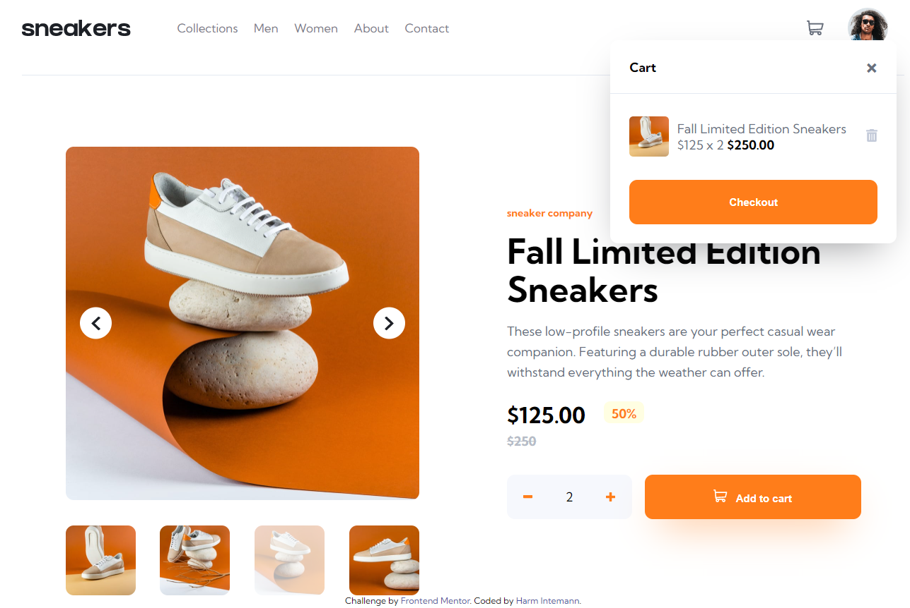

# Frontend Mentor - E-commerce product page solution

This is a solution to the [E-commerce product page challenge on Frontend Mentor](https://www.frontendmentor.io/challenges/ecommerce-product-page-UPsZ9MJp6). Frontend Mentor challenges help you improve your coding skills by building realistic projects.

## Table of contents

- [Overview](#overview)
  - [The challenge](#the-challenge)
  - [Screenshot](#screenshot)
  - [Links](#links)
- [My process](#my-process)
  - [Built with](#built-with)
  - [What I learned](#what-i-learned)
  - [Continued development](#continued-development)
  - [Useful resources](#useful-resources)
- [Author](#author)
- [Acknowledgments](#acknowledgments)

**Note: Delete this note and update the table of contents based on what sections you keep.**

## Overview

This challenge only offered a layout for mobile and desktop. It is therfor only optimitzed for two different sizes.

### The challenge

Users should be able to:

- View the optimal layout for the site depending on their device's screen size
- See hover states for all interactive elements on the page
- Open a lightbox gallery by clicking on the large product image
- Switch the large product image by clicking on the small thumbnail images
- Add items to the cart
- View the cart and remove items from it

### Screenshot




### Links

- Solution URL: [Add solution URL here](https://github.com/ghintema/FrontEndMentor_E-commerce-product-page.git)
- Live Site URL: [Add live site URL here](https://ghintema.github.io/FrontEndMentor_E-commerce-product-page/)

## My process

- Design analysis: extracting font-styles and colors from figma-file.
- defining CSS variables
- defining CSS utility classes
- writing markup, including styles via utility classes
- writing layout for mobile design
- writing layout for tablet and/or desktop
- writing functionality with JavaScript for menu, slider and cart

### Built with

- Semantic HTML5 markup
- CSS custom properties
- Flexbox
- CSS Grid
- Mobile-first workflow
- Vanilla JavaScript (for menu, slider and cart)


### What I learned

- DOM-Manipulation for for updating the cart
- How to build a fully-functional slider with autoplay-start-stopp, thumbnail-highlightening and swipe-able.
- How to build a modal. I finally decided against the modal in favor for plugin the slider directly in the main page. 
- A lot about stacking, different levels of stacking, different stacking contexts, and z-index in the context of position not(static).


```html
<h1>Some HTML code I'm proud of</h1>
```
```css
.proud-of-this-css {
  color: papayawhip;
}
```
```js
const proudOfThisFunc = () => {
  console.log('🎉')
}
```

### Continued development


### Useful resources

https://developer.mozilla.org/en-US/

## Author

Harm Intemann, Bolivia, September 2022

## Acknowledgments

This is where you can give a hat tip to anyone who helped you out on this project. Perhaps you worked in a team or got some inspiration from someone else's solution. This is the perfect place to give them some credit.

**Note: Delete this note and edit this section's content as necessary. If you completed this challenge by yourself, feel free to delete this section entirely.**
